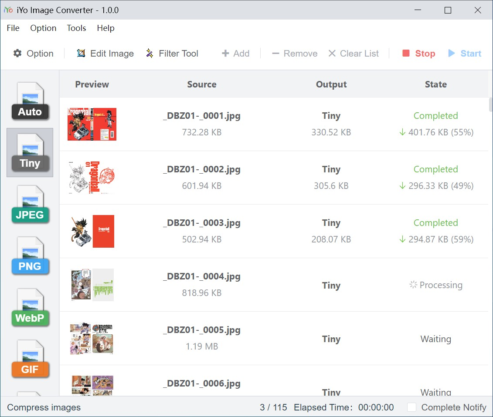

# iYo Image Converter | 哎哟图片转换器

A free native image converter | 一个免费的本地图片转换工具



Base on [sharp](https://sharp.pixelplumbing.com/) and [NW.js](https://nwjs.io/).

[Download](https://github.com/ssnangua/iyo-image-converter/releases) | [Screenshots](screenshots/en.md) | English Document | [中文文档](README_zh.md)

## Features

- Convert / Tiny image
- Resize / Rotate image
- Add watermark
- Supported image formats: `.png`,`.jpg`,`.jpeg`,`.webp`,`.gif`,`.tif`,`.tiff`,`.avif`,`.heif`,`.bmp`,`.ico`,`.svg`, animated GIF/WebP/APNG
- Edit Image
    - Crop image
    - Rotate image
    - Supportted animated image
- Filter Tool
    - Supportted animated image
    - Supportted custom filters
- Anime Tool
    - Create animated image
    - Add text
    - Extract frames
- ICO Tool
    - Create multi-size `.ico` image
    - Extract frames
    - Extract `.ico` image from `.exe`,`.dll`,`.ocx`,`.cpl` file
- PDF Tool
    - Export images from a PDF file
    - Generate a PDF file from images
- Mirage Tank
    - A simple way to generate a mirage-tank image

## Custom Filter

The filter files are in the `root/filters/` directory, and you can write your own filters. See [Custom Filter](./Custom Filter.md).

## Development

```bash
# install
yarn

# rebuild sharp
cd node_modules\sharp
nw-gyp configure --target=0.68.1
nw-gyp build --target=0.68.1

# dev (root directory)
yarn dev

# build
yarn build
```

## Reference

Icons referenced from:

- [iconfont](https://www.iconfont.cn/)

Preset filters referenced from:

- [glfx.js](https://github.com/evanw/glfx.js) - An image effects library for JavaScript.
- [Konva](https://github.com/konvajs/konva) - A HTML5 2d canvas js library.
- [Pixels.JS](https://github.com/silvia-odwyer/pixels.js) - An image filtering library with over 70 photo filters.
