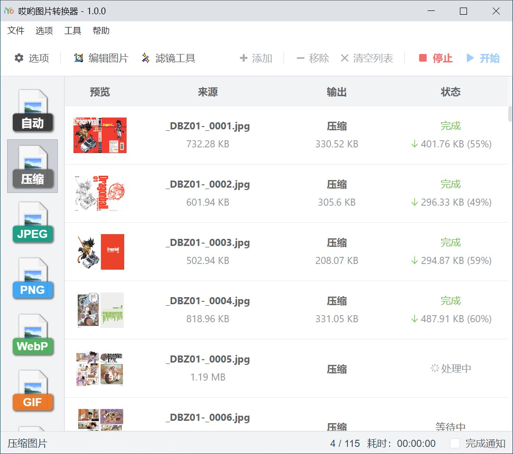

# iYo Image Converter | 哎哟图片转换器

A free native image converter | 一个免费的本地图片转换工具



基于 [sharp](https://sharp.pixelplumbing.com/) 和 [NW.js](https://nwjs.io/)。

[下载](https://github.com/ssnangua/iyo-image-converter/releases) | [截图](./screenshots/) | [English Document](README.md) | 中文文档

## 特性

- 图片格式转换、图片压缩
- 调整图片大小、旋转图片
- 添加水印
- 支持的图片格式: `.png`,`.jpg`,`.jpeg`,`.webp`,`.gif`,`.tif`,`.tiff`,`.avif`,`.heif`,`.bmp`,`.ico`,`.svg`, GIF/WebP/APNG 动图
- 动图工具
  - 创建动图
  - 给动图添加文字
  - 导出动图帧图片
- 图标工具
  - 创建多尺寸 `.ico` 图片
  - 导出图标中的图片
  - 导出 `.exe`,`.dll`,`.ocx`,`.cpl` 文件中的 `.ico` 图片

## 开发

```bash
# 初始化
yarn

# 重新构建 sharp
cd node_modules\sharp
nw-gyp configure --target=0.68.1
nw-gyp build --target=0.68.1

# 开发（根目录）
yarn dev

# 构建
yarn build
```
